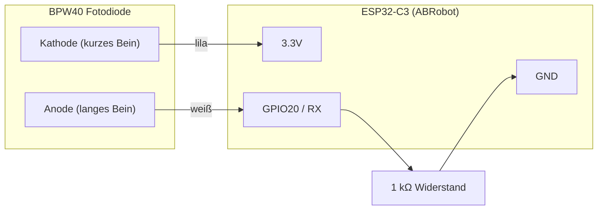

# esphome-sml-reader

**Sprache:** [English](README.md) | Deutsch

Lies deinen Stromzähler über die Infrarot-(IR)-Schnittstelle aus – **ohne** Eingriff in die Netzverkabelung.  
Verwendet einen **ESP32-C3 mit OLED-Display** (ABRobot 0.42") und eine **BPW40 Fotodiode**, um SML-Daten von einem ISKRA-Zähler zu empfangen. Die Werte werden per WLAN an **Home Assistant** übertragen.

> **Voraussetzung:** Aktiviere zuerst die IR-Diode am Zähler. Gib die PIN an der Zählerfront (laut Anleitung deines Netzbetreibers) ein, damit die IR-LED leuchtet und detaillierte SML-Daten verfügbar sind.


## Funktionen

- **Aktuelle Leistung** (W) — Bezug und Einspeisung
- **Zählerstände gesamt** (kWh) — Bezug & Einspeisung
- **Kleines OLED-Display** — wechselt zwischen aktueller Leistung, Bezug gesamt, Einspeisung gesamt
- **Blaue LED** — blinkt, wenn Daten empfangen werden
- **Web-Oberfläche** — integriert auf Port 80
- **OTA Updates** — Firmware-Updates über WLAN

## ESPHome Web UI


## Was du brauchst

| Teil | Hinweis |
|---|---|
| ESP32-C3 OLED Board (ABRobot 0.42") | Integriertes 72×40 SSD1306 Display |
| BPW40 Fotodiode | Empfängt das IR-Signal des Zählers |
| 1 kΩ Widerstand | Pull-Down für das Fotodioden-Signal |
| 3D-gedrucktes Gehäuse + Magnet-Halter | Optional, aber für eine saubere Montage empfehlenswert |
| Neodym-Magnet (5 mm ⌀ × 3 mm) | Hält das Gehäuse am Zähler |
| USB-C Kabel + Netzteil | Versorgt den ESP32 im Zählerschrank |

## Teile-Übersicht


*Von links nach rechts: 3D-gedruckter Magnet-Halter, Gehäuse mit lichtdichtem Fach für die Fotodiode, BPW40 + Widerstand an Dupont-Kabeln, ESP32-C3 ABRobot Board.*

## Zusammengebaut


*Der ESP32-C3 sitzt im 3D-gedruckten Gehäuse. OLED-Display und USB-C-Port sind vorne zugänglich.*

## Verdrahtung

Die BPW40 Fotodiode wird mit nur drei Leitungen und einem Widerstand am ESP32-C3 angeschlossen:



> **Wichtig:** Die Fotodiode wird in Sperrrichtung betrieben (Kathode → 3.3V). Der 1 kΩ Widerstand zieht GPIO20 auf GND. Wenn die IR-LED des Zählers pulst, leitet die Fotodiode und das Signal auf GPIO20 ändert sich – der ESP32 liest das als serielle SML-Daten.


## Installation

1. **Firmware flashen**  
   `esphome_smartmeter_en.yaml` (oder `_de.yaml` für Deutsch) in dein ESPHome Dashboard übernehmen und WLAN-Zugangsdaten in `secrets.yaml` hinterlegen:
   ```yaml
   wifi_ssid: "DeinWLAN"
   wifi_password: "DeinPasswort"
   ```

2. **Fotodiode anschließen**  
   BPW40 wie im Diagramm oben anschließen.

3. **3D-gedrucktes Gehäuse vorbereiten**  
   Je nach Drucker und Filament können die Löcher für die Fotodioden-Beinchen zu eng sein. Ggf. vorsichtig aufbohren – bei mir hat ein **3 mm Bohrer** gut funktioniert.

4. **Am Zähler befestigen**  
   Den Neodym-Magnet (5 mm ⌀ × 3 mm) in den Halter drücken. Die Fotodiode direkt auf die IR-Schnittstelle des Zählers setzen. Das muss **lichtdicht** sein (Gehäuse oder schwarzes Tape). Der Magnet hält die Einheit am Zählergehäuse.

5. **Stromversorgung**  
   USB-C anschließen. Das Display zeigt "Warte…", bis das erste SML-Telegramm empfangen wird (meist nach wenigen Sekunden).

6. **In Home Assistant hinzufügen**  
   Das Gerät wird über die ESPHome-Integration automatisch gefunden. Du erhältst u. a. diese Sensoren:
   - **Aktuelle Leistung** (W)
   - **Zählerstand Bezug gesamt** (kWh)
   - **Zählerstand Einspeisung gesamt** (kWh)

> **Hinweis:** Zählerschränke sind oft aus Metall und schirmen WLAN stark ab. Stelle sicher, dass der ESP32 ein stabiles Signal hat.

## Im Zählerschrank


*Der Reader sitzt neben dem ISKRA-Zähler im Schrank. Das OLED zeigt die aktuelle Leistung (483 W auf dem Foto). Die blaue LED bestätigt aktiven Empfang.*

## Display-Seiten

Das OLED wechselt automatisch alle 5 Sekunden:

| Seite | Label | Wert |
|---|---|---|
| 1 | `CURR` | Aktuelle Leistung in W |
| 2 | `IMPORT` | Bezug gesamt in kWh |
| 3 | `EXPORT` | Einspeisung gesamt in kWh |

## Kompatibilität

Getestet mit **ISKRA** Smart Metern, die **SML** über IR ausgeben. Sollte mit jedem SML-fähigen Zähler funktionieren – ggf. müssen die OBIS-Codes in der YAML-Konfiguration für dein Zählermodell angepasst werden.

## Mitmachen

Beiträge, Issues und Feature-Requests sind willkommen. Erstelle gerne ein Issue oder einen Pull Request.

## Lizenz

Dieses Projekt ist Open Source und unter der [MIT-Lizenz](LICENSE) verfügbar.

## Haftungsausschluss

Dieses Projekt wird **ohne Gewähr** bereitgestellt ("as-is"). Die Nutzung erfolgt auf eigenes Risiko. Der Autor übernimmt **keinerlei Haftung** für Schäden an Hardware, Software oder Eigentum sowie für Personenschäden, die aus der Nutzung dieses Projekts entstehen. Bitte beachte die örtlichen Sicherheits- und Elektro-Vorschriften, insbesondere beim Arbeiten im Zählerschrank.
