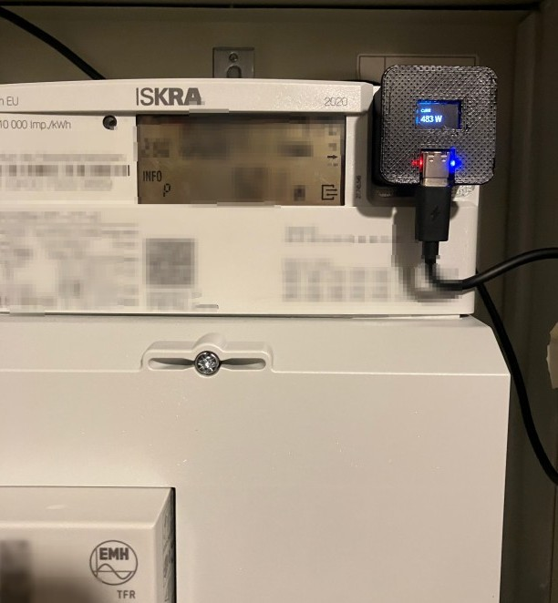
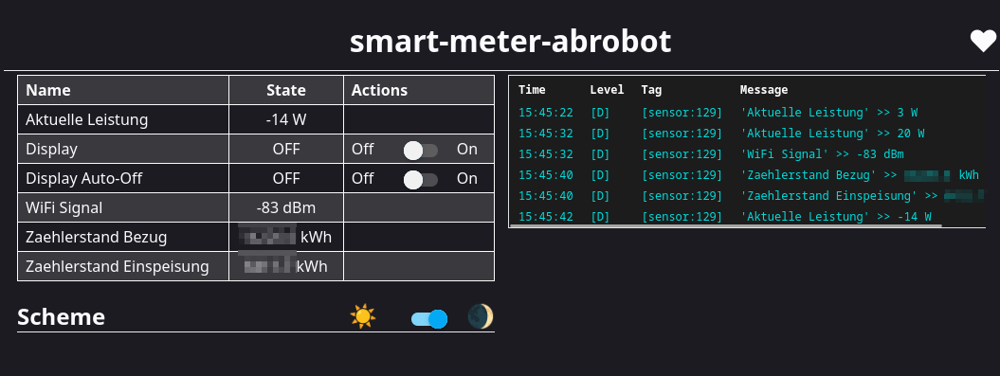
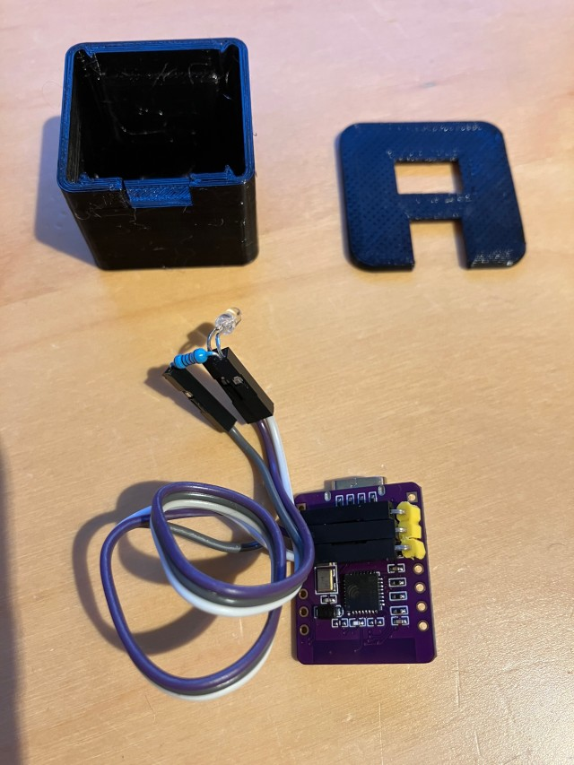
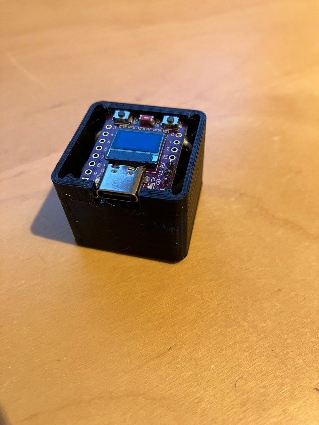
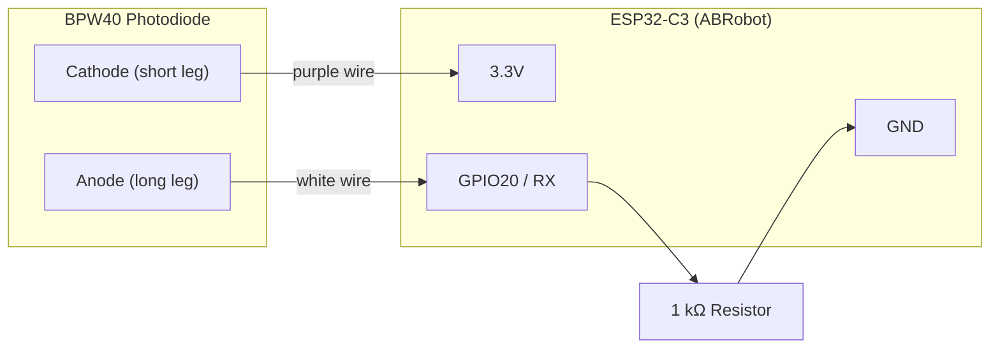
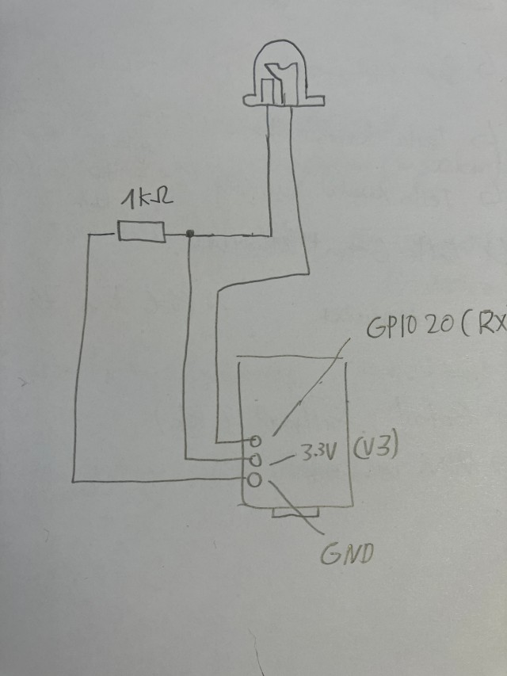

# esphome-sml-reader

**Language:** English | [Deutsch](README.de.md)

Read your electricity meter via its infrared (IR) interface — no wiring into mains required.  
Uses an **ESP32-C3 with OLED display** (ABRobot 0.42") and a **BPW40 photodiode** to receive SML data from an ISKRA smart meter. Values are pushed to **Home Assistant** over WiFi.



## Features

- **Real-time power** (W) — import and export
- **Total energy counters** (kWh) — grid import & grid export
- **Tiny OLED display** — cycles through current power, import total, export total
- **Blue LED** — blinks when data is being received
- **Web dashboard** — built-in on port 80
- **OTA updates** — flash new firmware over WiFi

## ESPHome Web UI



## What You Need

| Part | Notes |
|---|---|
| ESP32-C3 OLED board (ABRobot 0.42") | Has a built-in 72×40 SSD1306 display |
| BPW40 photodiode | Receives the IR signal from the meter |
| 1 kΩ resistor | Pull-down for the photodiode signal |
| 3D-printed case + magnet holder | Optional, but recommended for a clean install |
| Neodymium magnet (5 mm ⌀ × 3 mm) | Holds the case on the meter |
| USB-C cable + power supply | Powers the ESP32 inside the meter cabinet |

## Parts Overview



*Left to right: 3D-printed magnet holder, case with light-tight compartment for the photodiode, BPW40 + resistor on Dupont wires, ESP32-C3 ABRobot board.*

## Assembled Unit



*The ESP32-C3 sits in the 3D-printed case. The OLED display and USB-C port are accessible from the front.*

## Wiring Diagram

The BPW40 photodiode is connected to the ESP32-C3 with just three wires and one resistor:



> **Key point:** The photodiode is reverse-biased (cathode → 3.3V). The 1 kΩ resistor pulls GPIO20 to GND. When the meter's IR LED pulses, the photodiode conducts and the voltage on GPIO20 changes — the ESP32 UART reads this as serial SML data.



## Installation

1. **Flash the firmware**  
   Copy `esphome_smartmeter_en.yaml` (or `_de.yaml` for German) into your ESPHome dashboard and add your WiFi credentials to `secrets.yaml`:
   ```yaml
   wifi_ssid: "YourNetwork"
   wifi_password: "YourPassword"
   ```

2. **Wire the photodiode**  
   Connect the BPW40 as shown in the wiring diagram above.

3. **Prepare the 3D-printed case**  
   Depending on your printer and filament, the holes for the photodiode legs may be too tight. You might need to drill them out — a **3 mm drill bit** worked well in my case.

4. **Mount on the meter**  
   Press the neodymium magnet (5 mm ⌀ × 3 mm) into the holder. Place the photodiode directly over the meter's IR interface. It **must** be light-tight — use the 3D-printed case or black tape. The magnet snaps the unit onto the meter housing.

5. **Power up**  
   Plug in the USB-C cable. The display will show "Waiting…" until the first SML telegram arrives (usually within a few seconds).

6. **Add to Home Assistant**  
   The device will be auto-discovered via the ESPHome integration. You get three sensors:
   - **Current Power** (W)
   - **Grid Import Total** (kWh)
   - **Grid Export Total** (kWh)

## Installed on the Meter


*The reader sits next to the ISKRA meter in the cabinet. The OLED shows the current power draw (483 W in this photo). The blue LED confirms active data reception.*

## Display Pages

The OLED cycles automatically every 5 seconds:

| Page | Label | Value |
|---|---|---|
| 1 | `CURR` | Current power in W |
| 2 | `IMPORT` | Total grid import in kWh |
| 3 | `EXPORT` | Total grid export in kWh |

## Compatibility

Tested with **ISKRA** smart meters using the **SML protocol** over IR. Should work with any SML-capable meter — you may need to adjust the OBIS codes in the YAML config for your specific meter model.

## Contributing

Contributions, issues, and feature requests are welcome! Feel free to open an issue or submit a pull request.

## License

This project is open source and available under the [MIT License](LICENSE).

## Disclaimer

This project is provided **as-is**, without any warranty of any kind, express or implied. Use it at your own risk. The author assumes **no liability** for any damage to hardware, software, or property, nor for any personal injury resulting from the use of this project. Always follow local electrical safety regulations when working near your meter cabinet.
